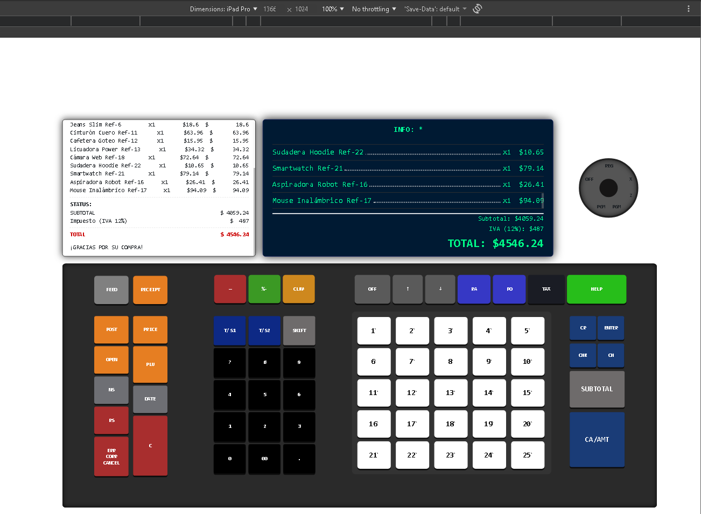
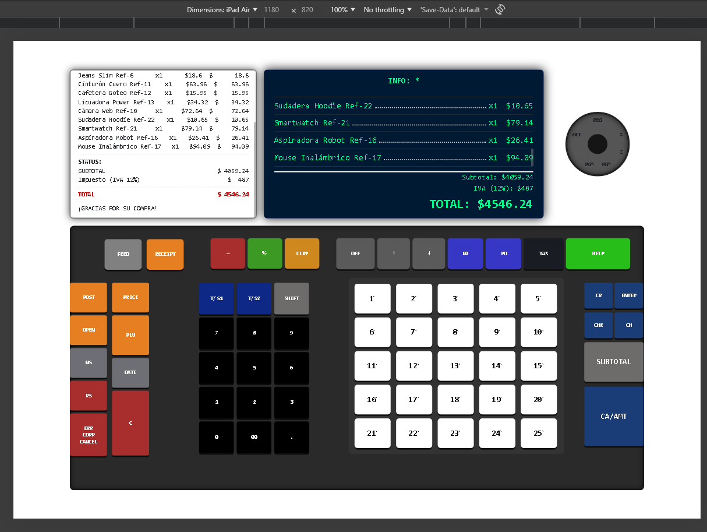

# ClaudPOSEPR · Frontend Angular
La aplicación de `ClaudPOSEPR`. Se construye sobre Angular 18 y usa Bootstrap 5 para el layout responsivo.

## Tecnologías clave
- Angular CLI 18.2.20
- Angular 18.x + RxJS 7.8
- Bootstrap 5.3.8
- `@abacritt/angularx-social-login` y `ng-recaptcha` para autenticación y validaciones
- Librerías ZXing / `@zxing/ngx-scanner` para capturar códigos QR desde el navegador

## Requisitos previos
1. Tener instalado Node.js (LTS 18 o 20) y npm (>=10). Si usas `nvm`, alinea la versión con `package.json`.
2. Angular CLI 18.2.20 (global o usar `npx ng` desde el proyecto).

## Puesta en marcha
```bash
cd Frontend
npm install --legacy-peer-deps
```
Luego puedes ejecutar los comandos útiles descritos abajo sin salir del directorio.

## Usuario demo (ADMIN)
* fernado4974@gmail.com (USER)
* fernando123A (PASSWORD)

## Comandos frecuentes
- `npm start` → `ng serve` con recarga en caliente en `http://localhost:4200/`.
- `npm run build` → construye los artefactos en `dist/`.
- `npm run watch` → recompila automáticamente en modo desarrollo.
- `npm test` → ejecuta las pruebas unitarias con Karma.
- `npx ng lint` → revisa estilo y errores de TypeScript. (Angular CLI lo ofrece por defecto aunque no esté en `scripts`.)
- `npx ng e2e` → prepara el runner de e2e si habilitas un paquete, por ejemplo `@angular-devkit/build-angular` con Cypress o Protractor.

> **Tip:** agrega `--configuration production` cuando ejecutes `npm run build` para generar una versión optimizada para despliegue.

## Organización relevante
- `src/app`: módulos, rutas y componentes que consumen los servicios de socket.io y los adaptadores de login social.
- `src/assets`: íconos, PNG y otros recursos estáticos expuestos en `public/`.
- `public/`: carpeta sincronizada con `angular.json` para archivos “copy assets” (favicon, policies, etc.).
- `.angular/` y `dist/`: directorios generados; no se versionan excepto cuando exportas una build para revisión.

## Flujo recomendado
1. Usa `npm start` durante el desarrollo funcional.
2. Para verificar integraciones, corre `npm test` y un `npx ng lint`.
3. Antes del deploy, ejecuta `npm run build -- --configuration production`.

## Capturas de referencia
| Vista | Descripción |
| --- | --- |
|  | Diseño de la pantalla principal adaptada a iPad Pro. |
|  | Versión del layout para iPad Air. |

Si necesitas nuevas vistas, sustituye las imágenes en este directorio y actualiza la tabla.
